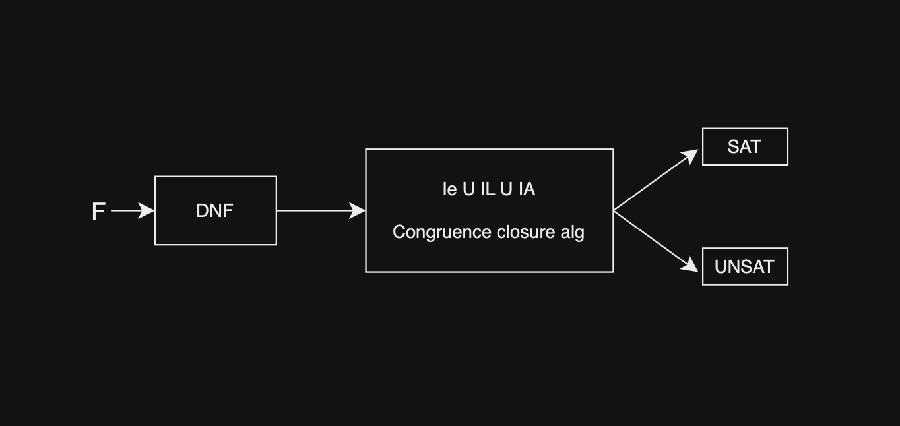
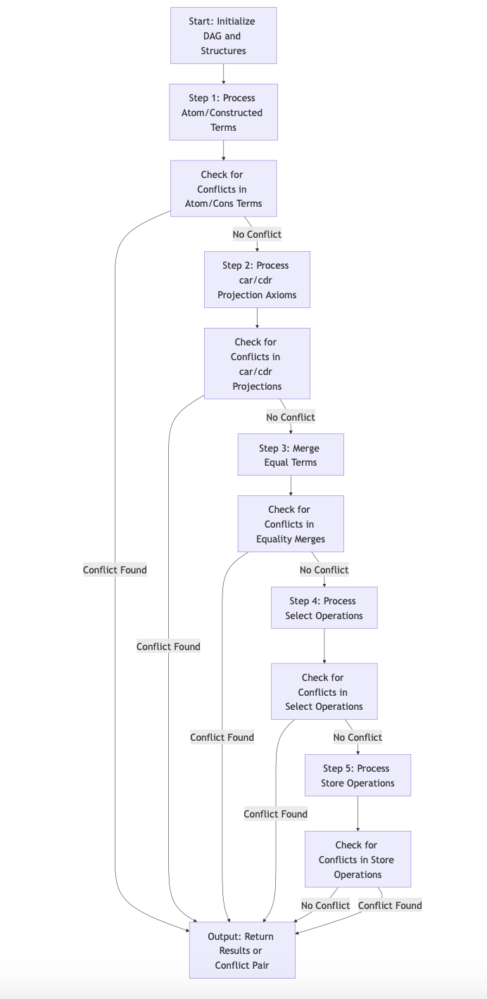
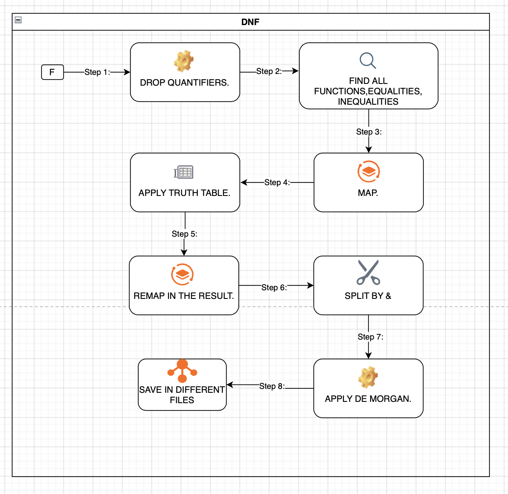

# CongruentClosureDAG

## Overview

This repository implements a Directed Acyclic Graph (DAG)-based congruence closure algorithm for solving the satisfiability of logical formulas in the quantifier-free fragment of equality theories. It supports multiple theories, including:

- **Equality Theory**: Manages formulas with equality and inequality relations.
- **Array Theory**: Handles array operations such as `select` and `store`.
- **List Theory**: Supports operations like `car`, `cdr`, and `cons`.

### Features

- **Optimizations**: Includes forbidden sets, efficient representative selection in `UNION`, and a non-recursive `FIND` function to enhance performance.
- **Scalability**: Built to handle complex logical formulas efficiently.
- **Transformation Support**: Includes the ability to convert formulas between Conjunctive Normal Form (CNF) and Disjunctive Normal Form (DNF).

---

## How to Run the Project

The project integrates formula parsing, congruence closure calculation, and visualization. To execute the project, follow the steps below from the `ccDag` directory:

### Prerequisites

- **Java Version**: Ensure Java 11.0.21 or later is installed.
- **Dependencies**: Include the required libraries: `gs-core-2.0.jar` and `gs-ui-swing-2.0.jar`.

### Compile the Source Code

1. **Compile the Source Code**:
   ```bash
    javac -cp libs/gs-core-2.0.jar:libs/gs-ui-swing-2.0.jar -d bin \
    src/App.java \
    src/GraphVisualization.java \
    src/CCAlgorithm/*.java \
    src/CCAlgorithm/parser/*.java \
    src/CCAlgorithm/bean/*.java \
    src/Transformation/Selection/*.java \
    src/Transformation/DNF2/*.java
   ```

### Run the Application

2. **Run the Application**:
   ```bash
   java -cp bin:libs/gs-core-2.0.jar:libs/gs-ui-swing-2.0.jar App
   ```

---

## Directory Structure

- **`src/`**: Contains all source code files.

  - **`CCAlgorithm/`**: Implements the core congruence closure algorithm.
  - **`CCAlgorithm/parser/`**: Includes parsers for reading logical formulas.
  - **`CCAlgorithm/bean/`**: Defines data structures used in the algorithm.
  - **`Transformation/Selection/`**: Contains selection transformation logic.
  - **`Transformation/DNF2/`**: Includes transformations to Disjunctive Normal Form and Conjunctive Normal Form.
  - **`GraphVisualization.java`**: Visualizes the congruence closure DAG.
  - **`App.java`**: Entry point of the application.

- **`bin/`**: Stores compiled `.class` files.
- **`libs/`**: Contains external dependencies, such as GraphStream libraries.

---

## Notes

- Ensure the `libs` folder contains the required dependencies: `gs-core-2.0.jar` and `gs-ui-swing-2.0.jar`.
- Before running, ensure all source files are properly compiled into the `bin` directory.
- The project leverages Java Swing for graphical visualization of the DAG.

---

## References

This implementation is inspired by Nelson-Oppen methods for combining decision procedures for multiple theories, with a focus on modularity and efficiency for practical use cases in SMT solving.



---

## Additional Details

1. **Start**: Choose to apply DNF transformation or directly process pre-transformed formulas in the `alreadyDnfFiles/` folder.
2. **Parser**: Parses formulas to make them compatible for DAG or DNF processing.
3. **Apply DAG or DNF**: Depending on the chosen path, transform formulas into DNF or process directly using the congruence closure DAG.
4. **Output**: Save results to files for further analysis.

### How ccDag Works:



The DAG-based congruence closure algorithm processes formulas by:

- Initializing the DAG with all terms and relationships.
- Merging terms marked as equal and checking for conflicts.
- Processing array and list operations to maintain consistency.
- Outputting the satisfiability result or the conflicting terms.

### How DNF Works:



The DNF (Disjunctive Normal Form) transformation works by:

1. Dropping quantifiers like `∀` and `∃`.
2. Mapping all functions and equality/inequality operations.
3. Simplifying the formula for DNF transformation.
4. Applying truth table transformations.
5. Re-mapping terms to complete the DNF transformation.
6. Saving results to files for further DAG processing.

---

## Java Versions

This project requires Java version 11.0.21 for compatibility and performance, but it should work fine with other versions as well.


# Formula Generator

This formula generator creates logical formulas based on various arguments you provide and saves them into a file.

## How to Run

1. **Navigate to the `ccDag` directory**:  
   Ensure your terminal is in the path `ccDag`, where the `formulaGenerator.java` file is compiled and executed.

2. **Compile the Java File**:  
   Run the following command to compile the `formulaGenerator.java` file:  
   ```bash
   javac src/formulaGenerator.java
   ```

3. **Run the Formula Generator**:  
   Use the following command to execute the formula generator:  
   ```bash
   java -cp src formulaGenerator <EQUALITIES> <DISEQUALITIES> <ATOM> <NOT_ATOM> <PRED> <NOT_PRED> <SELECT> <STORE> <MAX_RECURSION_DEPTH>
   ```

   ### Arguments Explained:
   - **EQUALITIES**: Number of equalities to generate (e.g., `x=y`).
   - **DISEQUALITIES**: Number of disequalities to generate (e.g., `x!=y`).
   - **ATOM**: Number of atomic formulas (e.g., `atom(x)`).
   - **NOT_ATOM**: Number of negated atomic formulas (e.g., `-atom(x)`).
   - **PRED**: Number of predicate formulas (e.g., `P(x, y)`).
   - **NOT_PRED**: Number of negated predicate formulas (e.g., `-P(x, y)`).
   - **SELECT**: Number of `select` operations to include (e.g., `select(a, i)` inside equalities or disequalities).
   - **STORE**: Number of `store` operations to include (e.g., `store(a, i, v)` inside equalities or disequalities).
   - **MAX_RECURSION_DEPTH**: Maximum recursion depth for generating terms.

4. **Output**:  
   The generated formula will be saved in the `src/alredyDnfFiles/` directory. The file name includes a timestamp to avoid overwriting.

## Example Usage

```bash
java -cp src formulaGenerator 5 3 2 1 4 2 2 3 3
```

This will generate a formula with the following configuration:
- 5 equalities
- 3 disequalities
- 2 atomic formulas
- 1 negated atomic formula
- 4 predicate formulas
- 2 negated predicate formulas
- 2 `select` operations
- 3 `store` operations
- Maximum recursion depth of 3

The output file will be located in `src/alredyDnfFiles/`. Check the console for the exact file path.

## Notes

- Ensure the `src` directory exists in `ccDag`.
- Java version 8 or higher is recommended.
- The generator will randomize terms and ensure no duplicate equalities.

Feel free to modify the generator or extend it to suit your needs!
